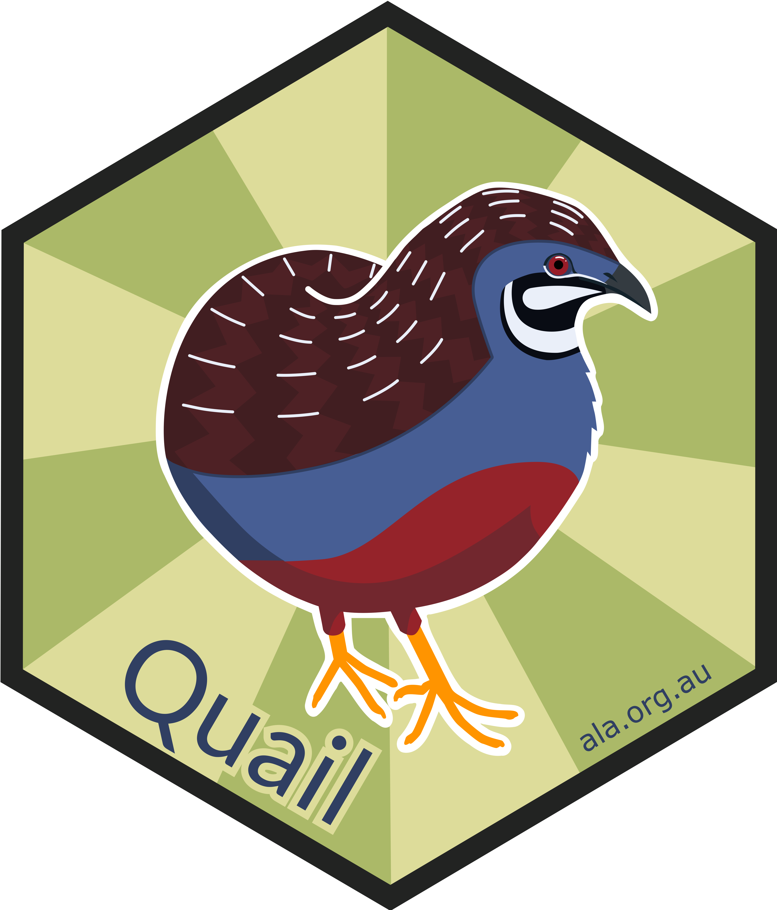

# Quail

# Quail <a href="https://quail.ala.org.au"></a>

<!-- badges: start -->

<!-- [](https://app.codecov.io/gh/AtlasOfLivingAustralia/galah-python?branch=main) -->

<!-- badges: end -->

## Overview

`Quail` is a plugin for [QGIS](https://qgis.org/) designed for users 
to interface with biodiversity data from a multitude of Living Atlases, 
including [Atlas of Living Australia](https://www.ala.org.au) (ALA), the 
[Global Biodiversity Information Facility](gbif.org) (GBIF), as well as 
7 other atlases.  These Living Atlases organise, collate and store 
observations of individual life forms using the [‘Darwin Core’](https://dwc.tdwg.org/) 
data standard.  `Quail` was built and is maintained by the 
[Science & Decision Support Team](https://labs.ala.org.au) at the ALA.

`Quail` enables users to locate and download species occurrence records
(observations, specimens, eDNA records, etc.), taxonomic information, or
associated media such as images or sounds, and to restrict their queries
to particular taxa or locations. Users can download a set of occurrence 
records, and can choose to summarise it as a species list.

If you have any comments, questions or suggestions, please 
[contact us](mailto:support@ala.org.au).

## Installation (QGIS)

When you load QGIS, go to `Plugins`->`Manage and Install Plugins`.  Under the 
`Not installed` option, search for `Quail` and click `Install Plugin`.  You are 
then ready to go!

## Getting Started and Usage

View the [Quail website](https://quail.ala.org.au) for documentations and vignettes 
to get started.

## Licence 
This plugin was created and designed by Amanda Buyan under a MPL-2.0 licence, with 
additional support and help from the Science and Decision Support Team and others 
at the ALA.

-----------------------------------------------------

## For Contributors

##### Note: this part is still a work in progress. 

Thank you for contributing!  There are a few things that you need to do to be able to 
install so your contribution will proceed as smoothly as possible.

#### Homebrew/Chocolately

A lot of the programs required for development and contribution need to be installed 
on your computer, NOT through the Python Package Index, but by an external source.  
For Macs, I recommend [homebrew](https://brew.sh/).  For Windows, I have seen 
[Chocolatey](https://chocolatey.org/), though have not tried it myself.

All of the required packages for Homebrew/Chocolately are in ```brew.txt```.  

Homebrew:

```
<brew.txt xargs brew install
```

#### PyPI

I have put all the required Python packages for development in a ```requirements.txt``` 
folder.  Simply run ```pip install``` with the requirements folder.

```
pip install -r requirements-dev.txt
```