Getting Started
=====================================

.. important:: 

    You will need to register your email address at the living atlas you 
    want to download data from, otherwise you will get no data!

Now that you have successfully installed Quail, we’ll provide a quick 
introduction on building a query to get data. If you’re looking for a 
discussion on more specialised topics, the Deep Dives tab collates all 
vignettes on specialised topics. This tutorial serves as a quick start quide to get you acquainted with the plugin.

We will work through the following example (this is specific to the 
Australian atlas, but can be adapted for others):

.. admonition:: Query

    "What threatened bird species are present in the Local 
    Government Area of Shoalhaven in the year 2025?"

Taxonomy
-----------

Here you can specify taxonomic names for the plugin to search.  Since 
we are going to be searching for birds in the class *Aves*, we can type this into the text box like so:

.. figure:: images/Aves_Text_box.png
    :scale: 65
    :align: center

|

.. tip::
 
    The "Upload Species List" functionality is intended for larger lists and cases 
    where specifying higher order taxonomy helps disambiguate species. For a more in-depth 
    explanation of how to do this, see `Advanced Taxonomy <user_guide/taxonomy_advanced.html>`_.

.. admonition:: Part of query solved

    "What threatened **bird species** are present in the Local Government Area of Shoalhaven in the year 2025?"

Date
-----------

Next we can specify the date range relevant to our query. On the "Date" tab, you will see two calendars:

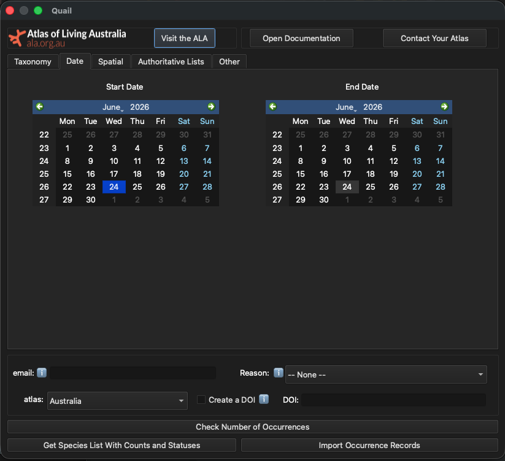

|

To choose the year 2025, we have to select 1 January 2025 for the start date and 31 December 2025 as the end date, like so:

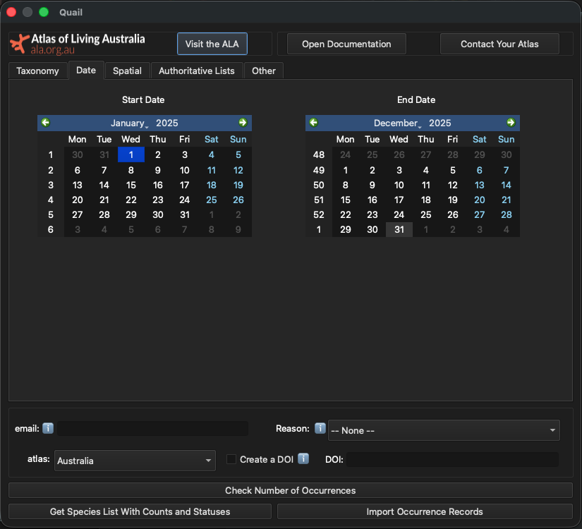

|

.. admonition:: Part of query solved

    "What threatened **bird species** are present in the 
    Local Government Area of Shoalhaven **in the year 2025**?"

Filtering By Spatial Layers
---------------------------------

Quail lets users filter using spatial objects uploaded to QGIS. You can do this by selecting the "Spatial" tab and clicking "Update Layers in Plugin."

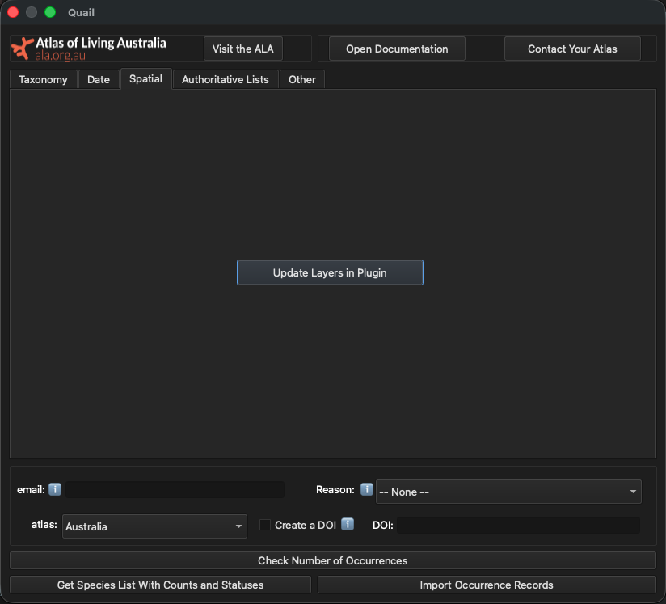

|

Once this is done, a pop up appears that shows all the available layers and fields that can be used to select the later. In this example, we will use LGA_NAME25 to load the names of all the LGAs into the plugin.

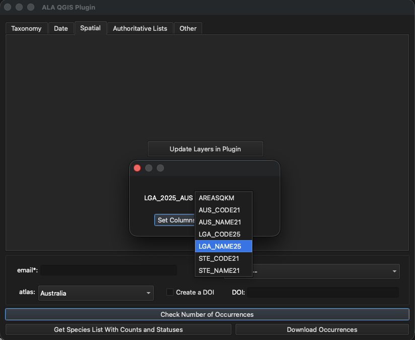

|

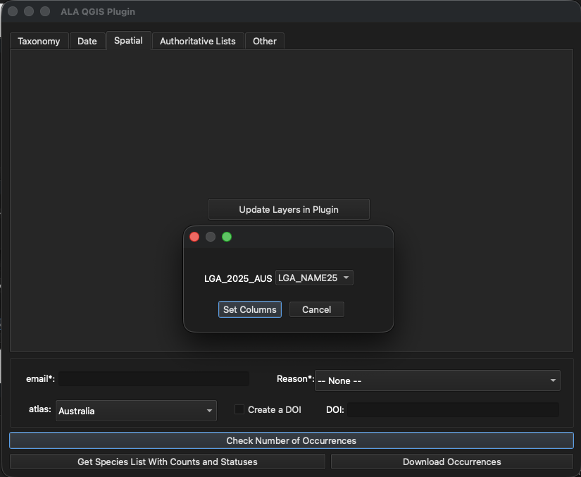

|

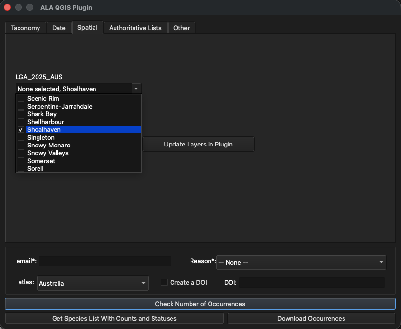

|

Now that all the layer attributes have been loaded into the plugin, select "Shoalhaven" from the names of the LGAs. 

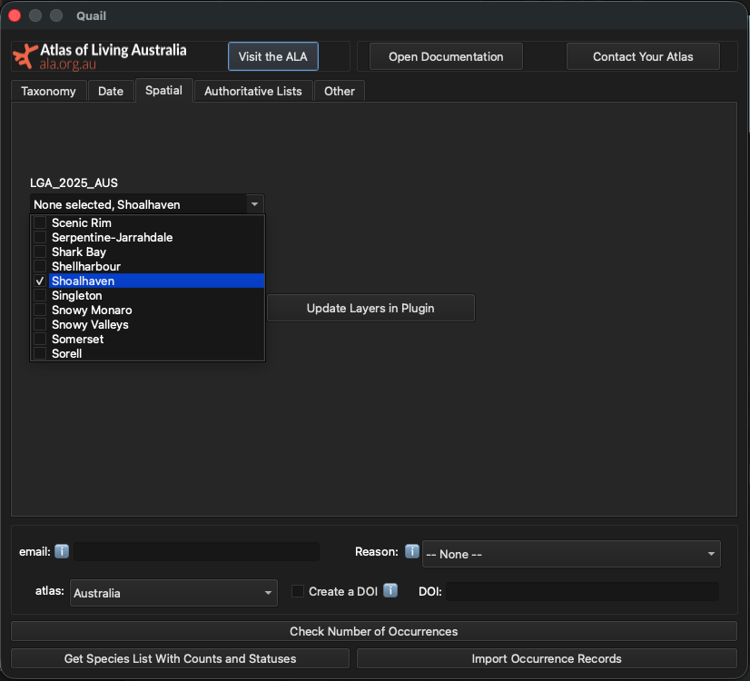

|

.. admonition:: Part of query solved

    "What threatened **bird species** are present 
    **in the Local Government Area of Shoalhaven in the year 2025**?"

Filtering by Authoritative Lists
----------------------------------------

.. important::
    
    This is only currently implemented for the Australian atlas. 
    `Contact us <mailto:support@ala.org.au>`_ if you would like 
    authoritative lists added for your atlas.

The Atlas of Living Australia (ALA) maintains a number of authoritative lists which document the status of certain taxa at the federal and state/territory levels. These lists allow us to inform users of threatened, migratory, or non-native status of taxa, as well as obfuscate records for taxa that are considered "sensitive". An example of a sensitive species is the Powerful Owl (*Ninox strenua*), which has seen habitat loss due to residential and agricultural development[1].

When you click on an authoritative list tick box, your query will return only results that are on that particular list. If you are interested in multiple lists, tick the relevant boxes and your resulting query will include species on all those lists.

Since the LGA of Shoalhaven is in New South Wales, we will need to check the box labelled New South Wales under the "Threatened" list.

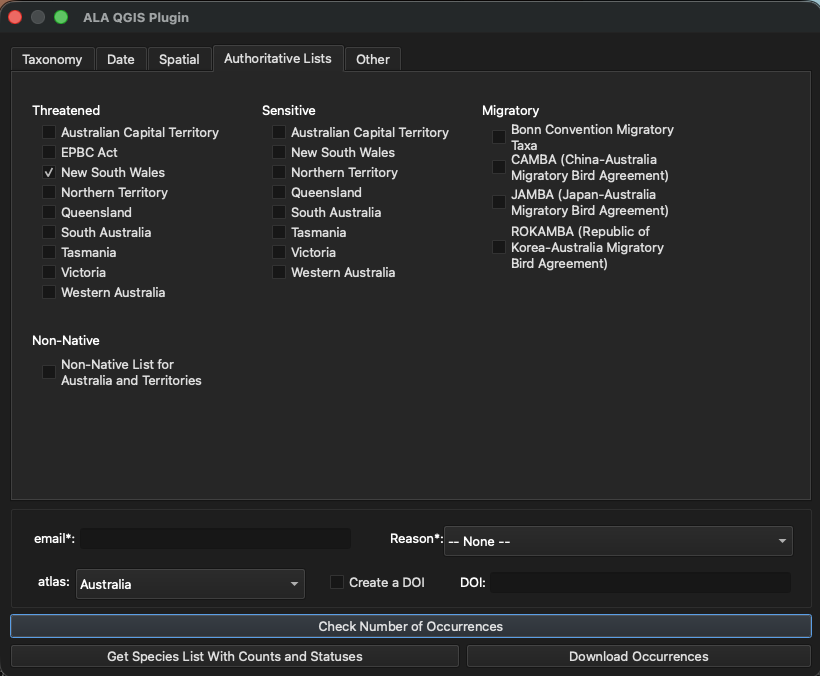

|

.. admonition:: Part of query solved

    "**What threatened bird species** are present **in 
    the Local Government Area of Shoalhaven in the year 2025**?"

Other important filters to consider
----------------------------------------

The "Other" tab contains options for additional filters, such as: basis of record, presence/absence of a species, and data profiles. Hovering your mouse over the `i` button will bring up additional information on these filters.   

In this example, we'll select the "Present" button to ensure we only 
get records of presences. 

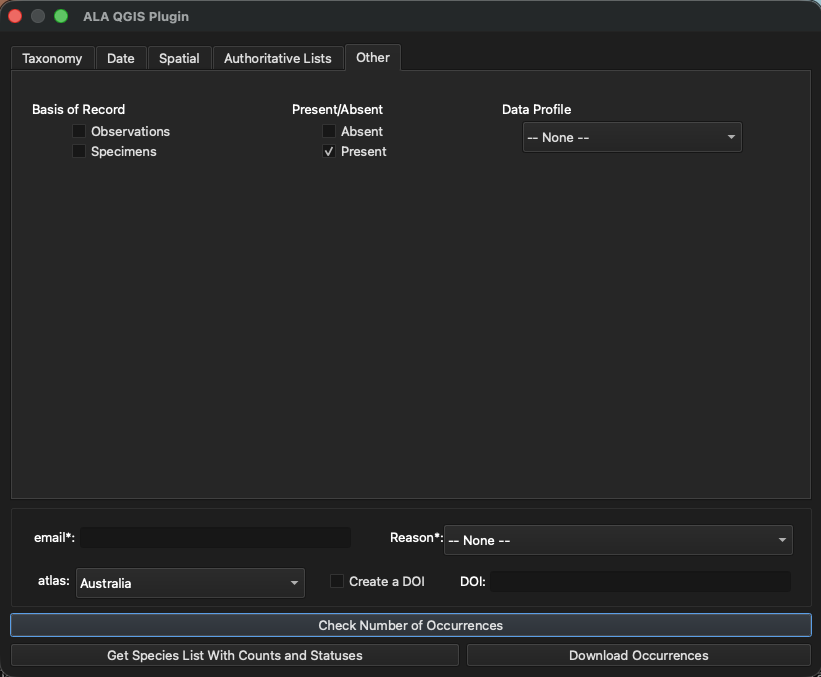

|

.. admonition:: Part of query solved

    "**What threatened bird species are present in 
    the Local Government Area of Shoalhaven in the year 2025**?"

Now, it is time to download the data!

Downloading data
----------------------------------------

Required Fields
^^^^^^^^^^^^^^^^^^^^^^^^^^^^^

There are two required fields when downloading either a list of species 
or species' locations: an email address and a reason for downloading these data.

- **Email**:  This should be an email of yours that you have registered with the relevant Living Atlas.
- **Reason**: This is to specify why you are downloading data from the chosen Living Atlas.  Examples are "environmental assessment" and "species modelling".  These reasons will change with each Living Atlas. 

This is how it should look:

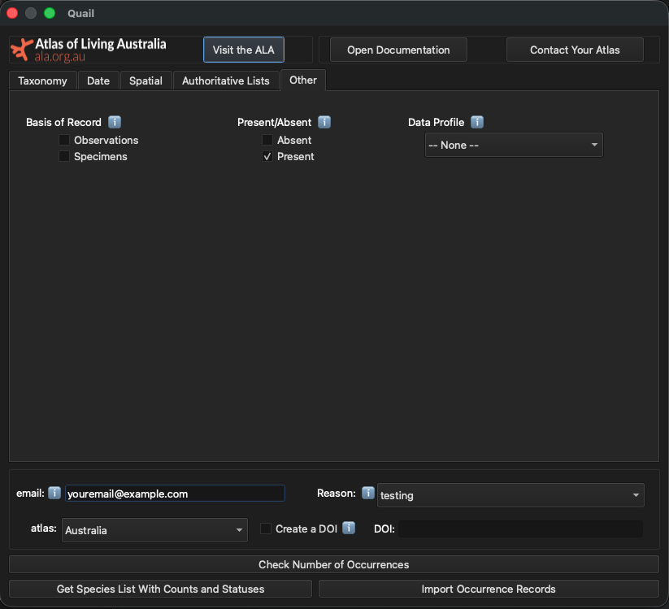

|

Optional But Recommended: Checking Number of Occurrences
^^^^^^^^^^^^^^^^^^^^^^^^^^^^^^^^^^^^^^^^^^^^^^^^^^^^^^^^^^

After you have created a query, it is time to start downloading data!  Before downloading the occurrence records, it is often a good idea to check the number of occurrences your in your download. This will help you understand how long the download will take (e.g. 1 million records will take longer than 1,000 records).  This is also a good way to get a sense of whether you're about to download a reasonable number of records, given the parameters of your query. 

To do this, click the "Check Number of Occurrences" button.  A box will pop up like this with the number of counts:

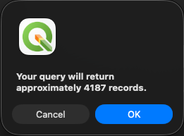

|

Download Occurrences
^^^^^^^^^^^^^^^^^^^^^^^^^^^^^

Now that we know we're expecting about 4,000 records, we can download the data. To do this, click the "Download Occurrences" button in the lower left corner:

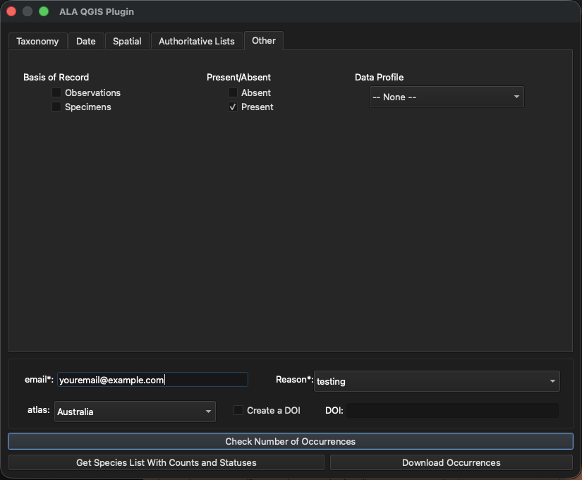

|

Now navigate back to the main QGIS window. Once the plugin has downloaded the 
occurrences, you will see a new layer titled "data" with all your other spatial layers. Your data should look like this:

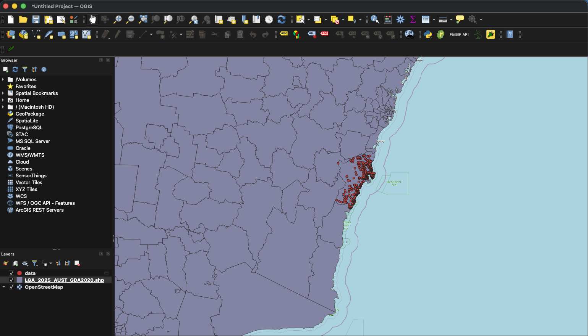

|

|

[1] https://threatenedspecies.bionet.nsw.gov.au/profile?id=10562
